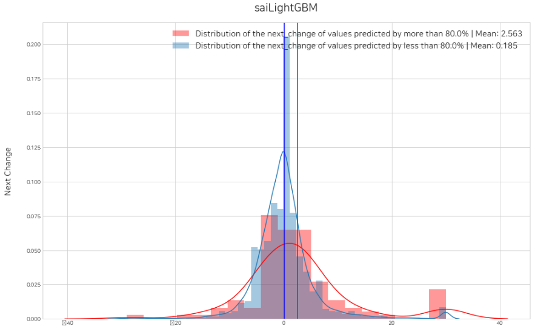

# StockAI:Python Machine Learning Framework for stock predcition. 

## 1. Summary

이 논문은 주가의 상승 및 하락 패턴을 학습하여 종가를 예측하는 기술적 연구에 대한 기록이다. 머신러닝에 특화된 주가 시계열 데이터셋 생성과, 인공지능 모델링 및 모델 평가가 가능한 라이브러리를 제공하여 주가 데이터 연구의 활용성과 편리성을 높이는 것이 본 연구의 목표이다. 우리 라이브러리를 사용해 예시 연구의 백테스팅을 수행하여 수익률 결과를 시각화한 결과 XGboost, LogisticRegression, LightGBM 모델들은 상승하는 추세를 보여 주가 예측에 유의미한 결과를 얻었다. 
학습, 연구를 위한 통합 패키지 , 백테스팅 강조 
 
 

## State of need 필요성

‘StockAI’는 기존 주가 예측 모델링 라이브러리의 문제점을 개선한 파이썬 라이브러리입니다. 우선, 기존에 있던 라이브러리는 기능이 제각각 다른 라이브러리로 분산되어 있어 사용하기 불편합니다. 예를 들면 데이터 로딩은 ‘fdreader’, ‘yfinance’ 등을, 데이터 전처리는 ‘pandas’, 모델링 관련은 ‘sklearn’, ‘keras’, ‘pytorch’를 사용해왔습니다. ‘StockAI’는 데이터 수집, 전처리, 모델링의 과정의 기능을 모듈화 함으로써 프로그래밍에 능숙하지 않은 사람도 손쉽게 주가 예측 연구를 진행할 수 있습니다. 또한, 이전에는 모델의 성능을 검증하는 데에 필요한 라이브러리가 존재하지 않았습니다. 검증은 모델의 신뢰성을 확보하기 위한 필수적인 과정입니다. ‘StockAI’의 모델 검증 함수를 활용하면 백 테스팅 및 결과 및 수익률 그래프를 손쉽게 그릴 수 있습니다. 이로써 미래 데이터를 사용하여 학습된 모델의 성능을 평가하고 결과를 한눈에 볼 수 있습니다. 마지막으로, 주가 데이터는 오픈소스이나 양질의 데이터를 충분히 확보하기 위하여 많은 시간과 돈이 필요합니다. ‘StockAI’의 사용자는 ‘KRX’, ‘Yahoo Finance’ 등에서 수집한 10년치 주가 데이터를 Github에서 다운받을 수 있습니다.

## Implementation and use in research 연구에서의 구현 및 사용  => usage 

sai는 주식 데이터 제공을 위해 해외 주가 데이터는 yfinance의 download를 사용하고, 국내(Korea) 주가 데이터는 krx 웹사이트의 공개된 주가 데이터를 크롤링하여 2001년 1월 1일부터 2022년 12월 31일까지 Open, High, Low, Close, Volume 데이터를 얻었다. read_data method에 원하는 Market 리스트를 입력 시, 종목(Code)과 Date별 Open, High, Low, Close, Volume 으로 구성된 통합 주가 데이터셋이 제공된다.
주가 예측 시 가장 큰 장애 요인은 거시 환경 및 시장의 변동성이라 할 수 있다. 이론적으로 주가의 무작위성은 딥러닝 알고리즘으로 어느 정도 해소가 가능하지만, 주가를 둘러싼 거시 환경과 시장의 급변과 같은 외부 충격은 주가 예측을 어렵게 만드는 요인이다.[@ref1_stock] 이를 해소하기 위한 투자 방법에는 과거의 주가 흐름이 미래에도 반복된다는 전제를 바탕으로 가격 및 거래량의 시계열 데이터를 특정한 수학적 공식을 이용해 생성한 지표들로 분석하여 추세를 파악하는 기술적 분석이 있다.[@ref2_backtesting] add_index method는 통합 주가 데이터셋의 Open, High, Low, Close, Volume 으로부터 보조지표 칼럼을 쉽게 추가할 수 있다. 또한 종목마다 상이한 스케일을 맞춰주기 위한 scaling method에는 MinMax, Standard, Robust와 가격 관련 변수들을 전날의 종가로 나누어 표준화하는 DivClose가 있다. time_series method는 일 단위 데이터를 당일(D_0) 대비 (D_-(N-1))까지 N일로 데이터를 재구성하여 시계열 데이터셋으로 변환한다.

[Figure 1] 시계열 주가 통합 데이터셋

모델 학습 및 예측과 예측 결과를 가지고 일정 threshold 기준으로 매수, 매도를 결정하는 매매일지 작성을 위한 Trader 클래스 사용 전, 사용자는 Train/Test 데이터셋을 분할하고, Buyer 에 사용할 모델을 선언해야 한다.
모델 학습 후에는 auc score와 precision, recall, f1 score 4가지의 평가지표에 대한 그래프 [Figure 2] 시각화를 지원하는 get_eval_by_threshold 함수를 통해 모델의 성능을 확인(or평가)하고, 주식 거래를 위해 machinelearning_buyer의 최적 예측 확률 threshold를 설정할 수 있다. 공식문서(?)에 제공되는 수원랩XGBoost, 경기랩LogisticRegression, 뽀로로LightGBM은 2017년 1월 1일부터 2020년 12월 31일까지 4년간의 데이터로 학습된 모델이며, test 데이터셋은 2021년 1월 1일부터 2021년 12월 31일까지 1년간의 데이터이 사용되었다. (그래프 참고)

[Figure 2] 모델 성능 평가 및 threshold 설정을 위한 평가지표 그래프

[Figure 2] 그래프를 보고 결정한 threshold는 트레이더 순서대로 리스트에 담아 set_threshold 함수의 lst_threshold 인자에 입력하면, threshold 기준으로 다음날 종가 변화율의 histogram plot으로 수익성을 미리 검증해볼 수 있다. 입력한 threshold는 트레이더 별 machinelearning_buyer 객체 안에 자동 저장된다. 

[Figure 3] threshold 기준으로 다음날 종가 변화율을 비교하는 그래프

decision 함수는 threshold 기준으로 매수, 매도가 자동 결정하여 모든 trader의 매매일지 작성이 완료되면, 하나의 DataFrame으로 반환한다. 매매일지 DataFrame은 매수(+)/매도(-) 상태와 매수/매도 할 비율, Close 정보로 구성된다.

[Figure 4, 5] 매매일지 데이터프레임(좌측)과 수익률 데이터프레임(우측)

simulation 함수는 작성된 매매일지를 토대로 수익률을 계산한다. leaderboard 함수는 트레이더 별로 총 수익률을 알 수 있고, yield_plot 함수는 거래일 별 수익률 그래프 시각화를 지원하여 모델의 성능을 한눈에 볼 수 있다는 이점이 있다. 이처럼 과거 데이터를 활용해 자신의 알고리즘 및 투자전략을 검증하는 백테스팅 과정을 포함한다. 

[Figure 6, 7] 트레이더 별 총 수익률(좌측)과 거래일 별 수익률 그래프(우측)

## 참고문헌
[1] 한태동. LSTM 을 이용한 주가 예측: 기술 지표, 거시 경제 지표, 시장 심리의 조합을 중심으로. 융복합지식학회논문지, 2021, 9.4: 189-198. https://journal.scvk.or.kr/articles/pdf/GRoJ/scvk-2021-009-04-0.pdf

[2] 최진영; 김민구. 기술적 지표 기반의 주가 움직임 예측을 위한 모델 분석. 한국정보처리학회 학술대회논문집, 2019, 26.2: 885-888. https://koreascience.kr/article/CFKO201924664108348.pdf

# References
